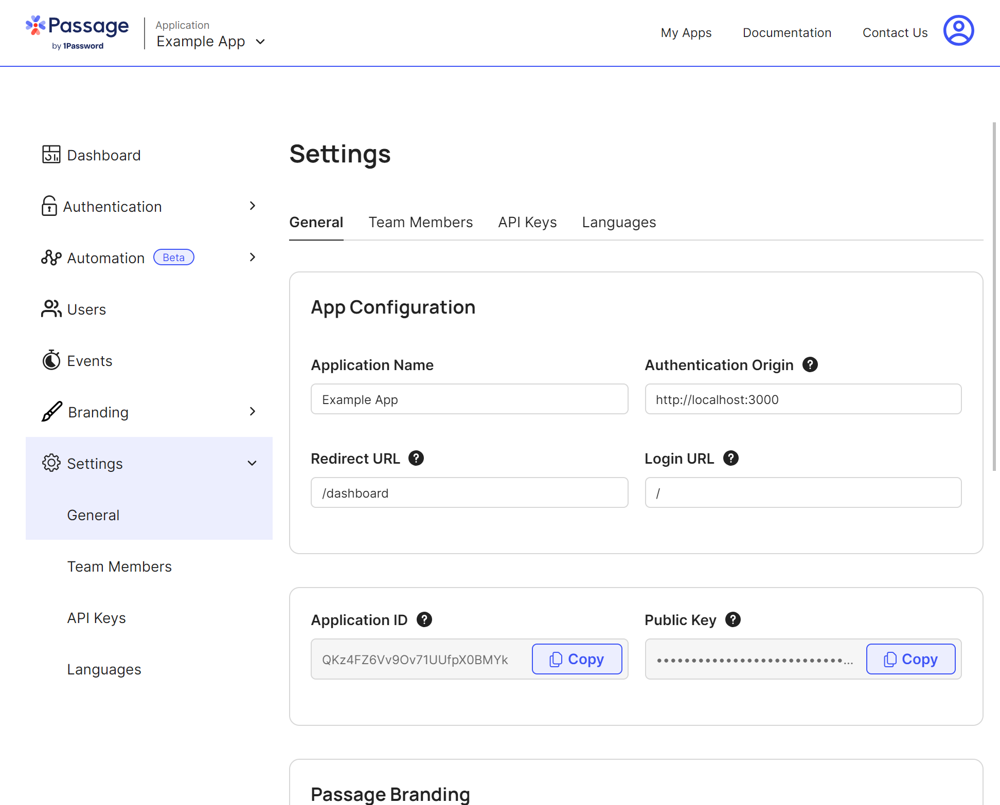

<a name="readme-top"></a>

<!-- PROJECT SHIELDS -->
<!--
*** I'm using markdown "reference style" links for readability.
*** Reference links are enclosed in brackets [ ] instead of parentheses ( ).
*** See the bottom of this document for the declaration of the reference variables
*** for contributors-url, forks-url, etc. This is an optional, concise syntax you may use.
*** https://www.markdownguide.org/basic-syntax/#reference-style-links
-->

[![Contributors][contributors-shield]][contributors-url]
[![Forks][forks-shield]][forks-url]
[![Stargazers][stars-shield]][stars-url]
[![Issues][issues-shield]][issues-url]
[![MIT License][license-shield]][license-url]

<!-- PROJECT LOGO -->
<br />
<div align="center">
  <a href="https://github.com/eludadev/Passage">
    
  </a>

<h3 align="center">Passage PHP SDK</h3>

  <p align="center">
    1Password Passage SDK for PHP Developers.
    <br />
    <a href="https://shelf.eluda.dev/passage-php-sdk"><strong>Read the article »</strong></a>
    <br />
    <br />
    <a href="https://github.com/eludadev/Passage/issues">Report Bug</a>
    ·
    <a href="https://github.com/eludadev/Passage/issues">Request Feature</a>
  </p>
</div>

<!-- TABLE OF CONTENTS -->
<details>
  <summary>Table of Contents</summary>
  <ol>
    <li>
      <a href="#about-the-project">About The Project</a>
      <ul>
        <li><a href="#built-with">Built With</a></li>
      </ul>
    </li>
    <li>
      <a href="#getting-started">Getting Started</a>
      <ul>
        <li><a href="#prerequisites">Prerequisites</a></li>
        <li><a href="#installation">Installation</a></li>
      </ul>
    </li>
    <li>
      <a href="#usage">Usage</a>
      <ul>
        <li><a href="#authenticating-requests">Authenticating Requests</a></li>
        <li><a href="#authenticating-a-request-with-PHP-middleware">Authenticating a Request With PHP Middleware</a></li>
        <li><a href="#app-information">App Information</a></li>
        <li><a href="#user-management">User Management</a></li>
        <li><a href="#user-device-management">User Device Management</a></li>
        <li><a href="#creating-magic-links">Creating Magic Links</a></li>
      </ul>
    </li>
    <li><a href="#example-usage">Example usage</a></li>
    <li><a href="#contributing">Contributing</a></li>
    <li><a href="#license">License</a></li>
    <li><a href="#contact">Contact</a></li>
    <li><a href="#acknowledgments">Acknowledgments</a></li>
  </ol>
</details>

<!-- ABOUT THE PROJECT -->

## About The Project

[![1Password’s Passage SDK for PHP Developers.][product-screenshot]](https://github.com/eludadev/Passage)

Introducing Passage SDK for PHP:

- Seamless integration with 1Password's Passage API
- Secure storage and retrieval of secrets
- Magic link authentication implementation
- Robust error handling
- Automatic conversion to native PHP `DateTime` objects
- Middleware support for easy integration
- Powerful SDK features for enhanced security in PHP projects

<p align="right">(<a href="#readme-top">back to top</a>)</p>

<!-- GETTING STARTED -->

## Getting Started

### Prerequisites

Start by creating a `laravel/laravel` project using PHP composer:

- composer
  ```sh
  laravel new my-php-project
  ```

### Installation

1. Create a [Passage account](https://console.passage.id/register)
2. Create a new [Passage application](https://console.passage.id/)
3. Retrieve your application's `<APP_ID>` and [`<API_KEY>`](https://console.passage.id/settings)
4. Add `<APP_ID>` and `<API_KEY>` to your local `.env` file:
   ```bash
   APP_ID=your_app_id
   API_KEY=your_api_key
   ```
5. Install package from [Packagist](https://packagist.org/packages/eludadev/passage)
   ```sh
   composer require eludadev/passage
   ```
6. Import the `Passage` class
   ```php
   use Eludadev\Passage\Passage;
   ```
7. Create an instance of the `Passage` class. \
   Set `<AUTH_STRATEGY>` to either `'COOKIES'` (_default_) or `'HEADER'`.
   ```php
   $passage = new Passage(env('APP_ID'), env('API_KEY'), '<AUTH_STRATEGY>' /* optional */);
   ```

<p align="right">(<a href="#readme-top">back to top</a>)</p>

<!-- USAGE EXAMPLES -->

## Usage

Authenticate requests and manage Passage users with Node.js.

> **Warning**
> To use the Passage PHP SDK, you'll need your Passage App ID. You can create a new Passage App in the [console](https://console.passage.id/).

> **Note**
> Assuming you followed the above prerequisites to create a new `laravel/laravel` project, you can quickly get started using this SDK in your API routes by opening the `routes/web.php` file and adding the following code:

```php
use Illuminate\Http\Request;
use Eludadev\Passage\Passage;
use Illuminate\Support\Facades\Route;

Route::get('/passage', function (Request $request) {
    $passage = new Passage(env('APP_ID'), env('API_KEY'));
    return $passage->createMagicLink("example@domain.com", "/redirect");
});
```

### Authenticating Requests

Passage makes it easy to associate an HTTP request with an authenticated user. The following code can be used to validate that a request was made by an authenticated user.

```php
use Illuminate\Http\Request;
use Eludadev\Passage\Passage;
use Illuminate\Support\Facades\Route;

// Authentication using Passage class instance
Route::get('authenticatedRoute', function (Request $request) {
    $passage = new Passage(env('APP_ID'), env('API_KEY'));

    try {
        // Authenticate request using Passage
        $userID = $passage->authenticateRequest($request);
        if ($userID) {
            // User is authenticated
            $userData = $passage->user->get($userID);
            return;
        }
    } catch (\Exception $e) {
        // Authentication failed
        return "Authentication failed!";
    }
});
```

By default, Passage looks for the user JWT from a cookie that is set by the Passage Element (`psg_auth_token`). If your application uses Authorization headers instead, you can pass the following option to the Passage PHP SDK.

```php
$passage = new Passage(env('APP_ID'), env('API_KEY'), 'HEADER');
```

### Authenticating a Request With PHP Middleware

If you used the `laravel/laravel` project, Passage provides a middleware that can be used directly. This middleware will authenticate a request and return a 401 Unauthorized if the token is invalid. If it succeeds, the Passage User ID will be available in the response. The following code shows how the Passage middleware can be used in a PHP application.

```php
use Illuminate\Support\Facades\Route;
use Illuminate\Http\Request;

use Eludadev\Passage\Passage;
use Eludadev\Passage\Middleware\PassageAuthMiddleware;

// Example of passage middleware
Route::get('authenticatedRoute', function (Request $request) {
  $passage = new Passage(env('APP_ID'), env('API_KEY'));
  $userID = $request->userID;
})->middleware(PassageAuthMiddleware::class);
```

If you are not using `eludadev/passage` in a request context, or your application is passing the JWT in a custom way, you can pass the JWT directly to the `validAuthToken` method to perform validation.

```php
$userID = $passage->validAuthToken($token);

if ($userID) {
  //authenticated
}
// otherwise, unauthorized
```

### App Information

The Passage SDK provides a way to retrieve information about an app.

```php
use Eludadev\Passage\Passage;

$passage = new Passage(env('APP_ID'), env('API_KEY'));
$appInfo = $passage->getApp();
```

### User Management

In addition to authenticating requests, the Passage PHP SDK also provides a way to securely manage your users. These functions require authentication using a Passage API key. API keys can be managed in the [**Passage Console**](https://console.passage.id/).

The functionality currently available on a user is:

- Get a user's information (including any defined user metadata)
- Activate or deactivate a user (a deactivated user will not be able to log in)
- Update a user's information (email address or phone number)
- Delete a user
- Create a user

> **Warning**
> Passage API Keys are sensitive! You should store them securely along with your other application secrets.

<details markdown="1">
  <summary>Get</summary>
  
```php
use Illuminate\Http\Request;

use Eludadev\Passage\Passage;
use Eludadev\Passage\Middleware\PassageAuthMiddleware;

Route::get('authenticatedRoute', function (Request $request) {
$passage = new Passage(env('APP_ID'), env('API_KEY'));

$userID = $request->userID;
  $passageUser = $passage->user->get($userID);
return $passageUser->email;
})->middleware(PassageAuthMiddleware::class);

````

</details>

<details markdown="1">
  <summary>Activate/Deactivate</summary>

```php
use Illuminate\Http\Request;

use Eludadev\Passage\Passage;
use Eludadev\Passage\Middleware\PassageAuthMiddleware;

Route::get('authenticatedRoute', function (Request $request) {
  $passage = new Passage(env('APP_ID'), env('API_KEY'));
  $userID = $request->userID;

  $deactivatedUser = $passage->user->deactivate($userID);
  $deactivatedUser->active; // false

  $activatedUser = $passage->user->activate($userID);
  $activatedUser->active; // true
})->middleware(PassageAuthMiddleware::class);
```

</details>

<details markdown="1">
  <summary>Update</summary>

```php
use Illuminate\Http\Request;

use Eludadev\Passage\Passage;
use Eludadev\Passage\Middleware\PassageAuthMiddleware;

Route::get('authenticatedRoute', function (Request $request) {
  $passage = new Passage(env('APP_ID'), env('API_KEY'));

  $userID = $request->userID;
  $passageUser = $passage->user->update($userID, [
    'email' => 'testEmail@domain.com',
    'phone' => '+15005550006'
  ]);

  $passageUser->email; // testEmail@domain.com
  $passageUser->phone; // +15005550006
})->middleware(PassageAuthMiddleware::class);
```

</details>

<details markdown="1">
  <summary>Delete</summary>

```php
use Illuminate\Http\Request;

use Eludadev\Passage\Passage;
use Eludadev\Passage\Middleware\PassageAuthMiddleware;

Route::get('authenticatedRoute', function (Request $request) {
  $passage = new Passage(env('APP_ID'), env('API_KEY'));

  $userID = $request->userID;
  $deletedUser = $passage->user->delete($userID);
  $deletedUser; // true
})->middleware(PassageAuthMiddleware::class);
```

</details>

<details markdown="1">
<summary>Create</summary>

```php
use Eludadev\Passage\Passage;

$passage = new Passage(env('APP_ID'), env('API_KEY'));

$newUser1 = $passage->user->create('testEmail@domain.com');
$newUser1->email; // testEmail@domain.com

$newUser2 = $passage->user->create(phone:'+15005550006');
$newUser2->phone; // +15005550006
```

</details>

| Field            | Type                               |
| ---------------- | ---------------------------------- |
| id               | string                             |
| email            | string                             |
| phone            | string                             |
| active           | boolean                            |
| email_verified   | boolean                            |
| created_at       | DateTime                           |
| last_login_at    | DateTime                           |
| webauthn         | boolean                            |
| user_metadata    | array                              |
| webauthn_devices | array of strings (e.g. "Mac OS X") |
| recent_events    | array of strings                   |

### User Device Management

The functionality currently available is:

- List all devices for a user
- Revoke a particular device from a user

<details markdown="1">
<summary>List Devices</summary>

```php
use Illuminate\Http\Request;

use Eludadev\Passage\Passage;
use Eludadev\Passage\Middleware\PassageAuthMiddleware;

Route::get('authenticatedRoute', function (Request $request) {
  $passage = new Passage(env('APP_ID'), env('API_KEY'));

  $userID = $request->userID;
  $devices = $passage->user->listDevices($userID);
  return $devices;
})->middleware(PassageAuthMiddleware::class);
```

</details>

<details markdown="1">
<summary>Revoke Device</summary>

```php
use Illuminate\Http\Request;

use Eludadev\Passage\Passage;
use Eludadev\Passage\Middleware\PassageAuthMiddleware;

Route::get('authenticatedRoute', function (Request $request) {
  $passage = new Passage(env('APP_ID'), env('API_KEY'));

  $userID = $request->userID;
  $success = $passage->user->revokeDevice($userID, '<DEVICE_ID>');
  return $success; // true
})->middleware(PassageAuthMiddleware::class);
```

</details>

### Creating Magic Links

The PHP SDK can be used to generate custom magic links (called "smart links") for users, that can be embedded into any content medium. To learn more, see our full guide on [Smart Links](https://docs.passage.id/auth-configuration/embedded-magic-links).

```php
use Eludadev\Passage\Passage;

$passage = new Passage(env('APP_ID'), env('API_KEY'));

$magicLink = $passage->createMagicLink('newEmail@domain.com', '/custom-path/1234');

// use Magic Link URL
$magicLink->url;
```

<p align="right">(<a href="#readme-top">back to top</a>)</p>

<!-- EXAMPLE USAGE -->

## Example Usage

We built an example full-stack application on React and a PHP backend.
Get started by opening the following directory: `cd ./examples`

> **Warning**
> Make sure you have [PHP](https://www.php.net/downloads) and [Composer](https://getcomposer.org/download/) installed on your local machine before continuing with these steps.


### Configuring a new Passage Project


Create a [new Passage project](https://console.passage.id/create/complete).
Make sure to input `http://localhost:3000` for the domain, and `/dashboard` for the redirect URL.

### Updating an existing Passage project



Head over to your project settings.

Input `http://localhost:3000` for the domain, and `/dashboard` for the redirect URL, and `/` for the login URL.

### Running the server

1. Go to the backend directory: `cd ./backend`
2. Install the dependencies: `composer install`
3. Copy the environment variables file: `cp .env.example .env`
4. Replace your [Passage credentials](https://console.passage.id/) in `.env`:
   ```
   PASSAGE_APP_ID=
   PASSAGE_API_KEY=
   ```
5. Run the server: `php artisan serve`

### Running the frontend

1. Go to the frontend directory: `cd ./frontend`
2. Install the dependencies: `yarn`
3. Copy the environment variables file: `cp EXAMPLE.env .env`
4. Replace your Passage credentials in `.env`:
   ```
   REACT_APP_PASSAGE_APP_ID=
   ```
5. Run the server: `yarn start`

### How it works

Here's the code powering the PHP backend:

```php
// routes/api.php

<?php

use Eludadev\Passage\Errors\PassageError;
use Eludadev\Passage\Passage;
use Illuminate\Http\Request;
use Illuminate\Support\Facades\Route;

// This route handles the authentication process for the '/auth' endpoint

Route::post('/auth', function (Request $request) {
    try {
        // Create a new instance of the Passage class using the Passage API credentials from the environment variables
        $passage = new Passage(env('PASSAGE_APP_ID'), env('PASSAGE_API_KEY'), 'HEADER');

        // Authenticate the request using the Passage API
        $userId = $passage->authenticateRequest($request);

        if ($userId) {
            // If authentication is successful, retrieve user data using the Passage API
            $userData = $passage->user->get($userId);

            // Determine the identifier based on the user data (email or phone)
            $identifier = $userData['email'] ? $userData['email'] : $userData['phone'];

            // Return the authentication status and identifier
            return [
                'authStatus' => 'success',
                'identifier' => $identifier
            ];
        }
    } catch (PassageError $e) {
        // Catch any errors that occur during the authentication process and echo the error message
        echo $e->getMessage();

        // Return the authentication failure status
        return [
            'authStatus' => 'failure'
        ];
    }
});
```

For this particular example, we chose to build the server on the Laravel framework, but the Passage PHP SDK can work on any PHP framework.

The frontend calls the `localhost:8000/api/auth` URL, which extracts the authentication header, decodes the JWK token, and retrieves the user ID. It then makes calls to the Passage API to retrieve more user information such as email and phone number.

All of this is done behind the scenes by the PHP SDK, so you don't have to worry about the intricate details.

<p align="right">(<a href="#readme-top">back to top</a>)</p>

<!-- CONTRIBUTING -->

## Contributing

Contributions are what make the open source community such an amazing place to learn, inspire, and create. Any contributions you make are **greatly appreciated**.

If you have a suggestion that would make this better, please fork the repo and create a pull request. You can also simply open an issue with the tag "enhancement".
Don't forget to give the project a star! Thanks again!

1. Fork the Project
2. Create your Feature Branch (`git checkout -b feature/AmazingFeature`)
3. Commit your Changes (`git commit -m 'Add some AmazingFeature'`)
4. Push to the Branch (`git push origin feature/AmazingFeature`)
5. Open a Pull Request

<p align="right">(<a href="#readme-top">back to top</a>)</p>

<!-- LICENSE -->

## License

Distributed under the MIT License. See [`LICENSE`][license-url] for more information.

<p align="right">(<a href="#readme-top">back to top</a>)</p>

<!-- CONTACT -->

## Contact

Younes Laaroussi - [Telegram](https://t.me/eludadev) - [hello@eluda.dev](mailto:hello@eluda.dev)

Project Link: [https://github.com/eludadev/Passage](https://github.com/eludadev/Passage)

<p align="right">(<a href="#readme-top">back to top</a>)</p>

<!-- ACKNOWLEDGMENTS -->

## Acknowledgments

Many thanks to 1Password and Hashnode for hosting this amazing hackathon! It was a lot of fun and a fantastic learning experience for me and all the other participants, and hopefully it can happen again! ❤️

<p align="right">(<a href="#readme-top">back to top</a>)</p>

<!-- MARKDOWN LINKS & IMAGES -->
<!-- https://www.markdownguide.org/basic-syntax/#reference-style-links -->

[contributors-shield]: https://img.shields.io/github/contributors/eludadev/Passage.svg?style=for-the-badge
[contributors-url]: https://github.com/eludadev/Passage/graphs/contributors
[forks-shield]: https://img.shields.io/github/forks/eludadev/Passage.svg?style=for-the-badge
[forks-url]: https://github.com/eludadev/Passage/network/members
[stars-shield]: https://img.shields.io/github/stars/eludadev/Passage.svg?style=for-the-badge
[stars-url]: https://github.com/eludadev/Passage/stargazers
[issues-shield]: https://img.shields.io/github/issues/eludadev/Passage.svg?style=for-the-badge
[issues-url]: https://github.com/eludadev/Passage/issues
[license-shield]: https://img.shields.io/github/license/eludadev/Passage.svg?style=for-the-badge
[license-url]: https://github.com/eludadev/Passage/blob/master/LICENSE
[product-screenshot]: assets/banner.png
````
