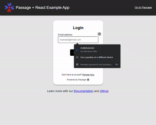
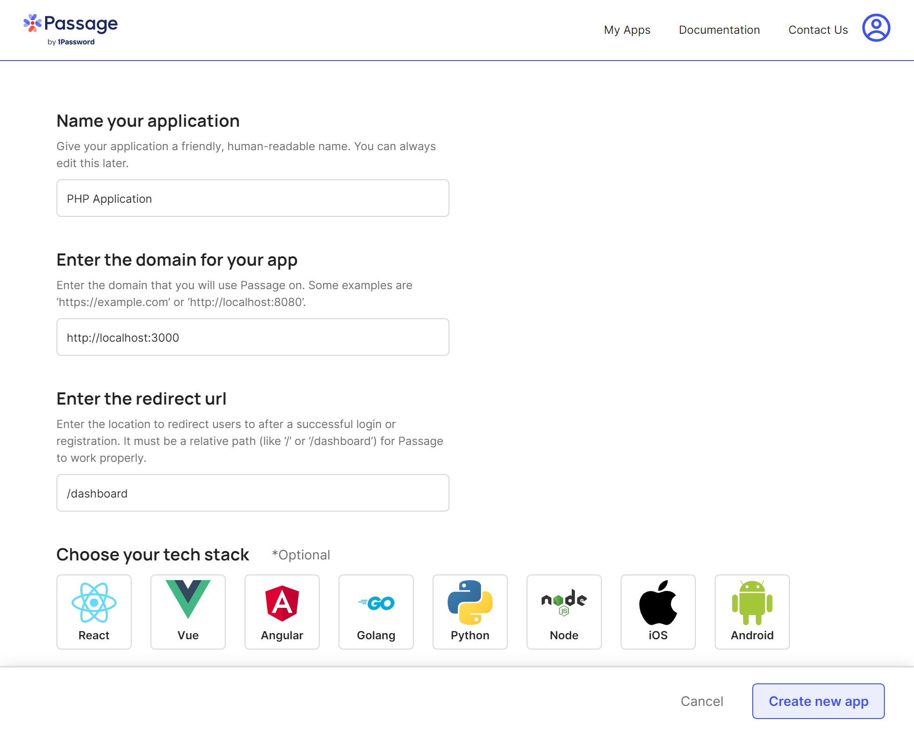
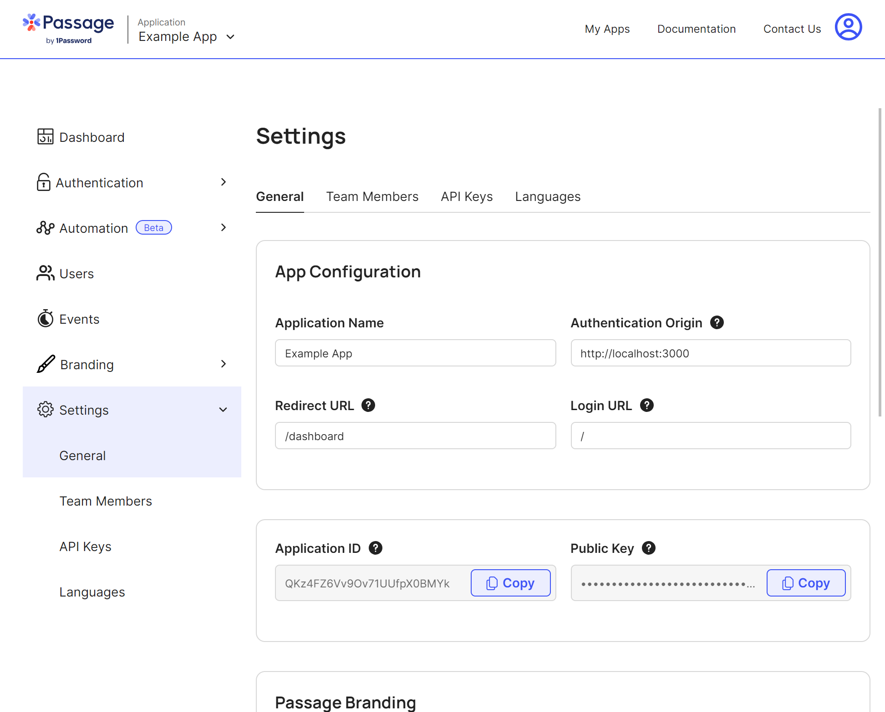

# How to use the Passage PHP SDK with React

We built an example full-stack application on React and a PHP backend.
Get started by opening the following directory: `cd ./examples`

> **Warning**
> Make sure you have [PHP](https://www.php.net/downloads) and [Composer](https://getcomposer.org/download/) installed on your local machine before continuing with these steps.



## Configuring a new Passage Project



Create a [new Passage project](https://console.passage.id/create/complete).
Make sure to input `http://localhost:3000` for the domain, and `/dashboard` for the redirect URL.

## Updating an existing Passage project



Head over to your project settings.

Input `http://localhost:3000` for the domain, and `/dashboard` for the redirect URL, and `/` for the login URL.

## Running the server

1. Go to the backend directory: `cd ./backend`
2. Install the dependencies: `composer install`
3. Copy the environment variables file: `cp .env.example .env`
4. Replace your [Passage credentials](https://console.passage.id/) in `.env`:
   ```
   PASSAGE_APP_ID=
   PASSAGE_API_KEY=
   ```
5. Run the server: `php artisan serve`

## Running the frontend

1. Go to the frontend directory: `cd ./frontend`
2. Install the dependencies: `yarn`
3. Copy the environment variables file: `cp EXAMPLE.env .env`
4. Replace your Passage credentials in `.env`:
   ```
   REACT_APP_PASSAGE_APP_ID=
   ```
5. Run the server: `yarn start`